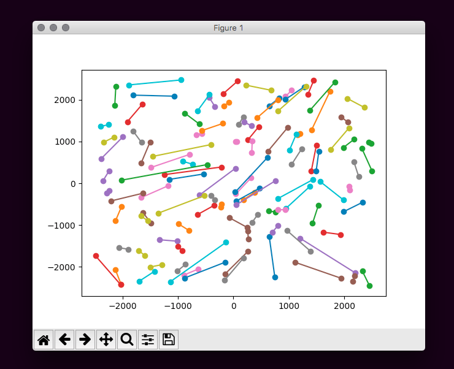

# 1411_visualize_toolkit


## Intro

- This is the toolkit for UVa 1411. This toolkit may can help you debuging your program by using human eyes.
- This toolkit can help you debug with visualize the output of your program.
- This script can run correct under python 3.6.5 and matplotlib 2.2.2

## 簡易介紹
- 這是我之前為找出 UVa 1411 這一題的 bug 所順手寫下的小工具。
- 這個小工具可以讀取你的input檔案以及output檔案，然後把圖給顯示出來，顯示出來的圖形可以讓你了解你的程式是否有問題。
- 這個工具經過測試可以正常運行於 python 3.6.5 以及 matplotlib 2.2.2。

----

## How to use
1. Download this folder to any place you want to.
2. Open your terminal or cmd on the computer. Move to the folder where you dl.
3.  Make sure that your python and matplotlib are installed.
4.  This script read 1411.in and 1411.out, where 1411.in is the txt contain the input data and 1411.out is the txt contain the output data of your program. There will be a sample files in the 1411_misc folder.
5. Make sure that the files that you want to check is in the same folder with draw.py.
6. If you are using the MacOS or UNIX system, input:

```bash
python3 draw.py
```
​	If Windows, input: (make sure the version of python is 3 but 2)
```bash
python draw.py
```
	and then will get a picture like this:



## 使用說明
1. 你可以用任何方法下載這個資料夾。
2. 開啟終端機，移動到你下載這個資料夾的位置。如果你不曾用過終端機的話，你可以在網路上搜尋他的簡單用法，非常容易懂的。
3. 在開始之前請先安裝好 python 以及 matplotlib，如果已經安裝好的話方可以進到下一步。
4. 這個腳本讀的檔案為 1411.in 以及 1411.out，如果需要修改讀的檔案的話可以往下看，下面備註的地方會寫說要更改的地方。
5. 請確認您的檔案是否都有在 draw.py 的旁邊。
6. 如果你是使用 MacOS 或是 UNIX 系統，輸入以下指令：
```bash
python3 draw.py
```
​	如果是使用 Windows 系統的話: (請確認你的 python 版本是 3.XX 而不是 2.XX，請注意：每台電腦的設定不同而會出現一些小小的差異)
```bash
python draw.py
```

7. 如果中途沒有任何錯誤的話，應該會看到跟以下圖片類似的圖
  

---
## Remarks:
1. This script support single dataset. If using multiple datasets will result error.
2. By modifing the -filename- and -filename2- in line 4 and line 5 in 1411_draw.py, you can read other file names.

## 備註：
1. 請注意：這個腳本的功能有點簡單，因為題目的輸入是多筆測資輸入，但是這個腳本很可愛，沒有製作成多筆測資，所以請小心多筆測輸入一定會出事 :P 。
2. 如果你想要讀入不同的檔案名稱只要修改 1411_draw.py 第４行和第５行的 filename 以及 filename2 即可。

---


##### Every files are made by Siang-En, Lo. 所有的檔案皆為羅祥恩所製作。
